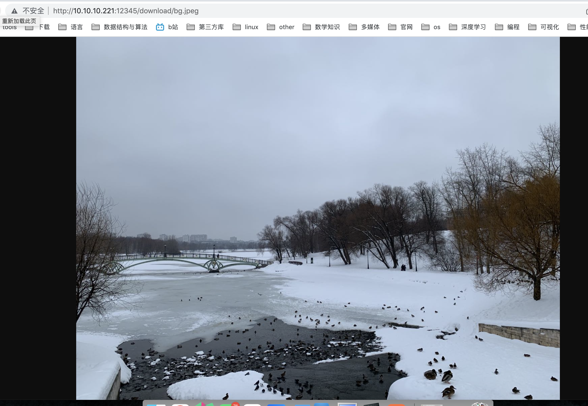

### 代码说明

```
支持文件上传和下载
上传地址:	/upload
下载地址:	/download
```

### 全局变量

#### method_table

map容器，保存了方法类型和对应字符串的k-v对。

```c++
// map容器，保存了方法类型和对应字符串
std::map<enum evhttp_cmd_type, const char *> method_table{
	{EVHTTP_REQ_GET, "GET"}, {EVHTTP_REQ_POST, "POST"},
	{EVHTTP_REQ_HEAD, "HEAD"}, {EVHTTP_REQ_PUT, "PUT"},
	{EVHTTP_REQ_DELETE, "DELETE"}, {EVHTTP_REQ_OPTIONS, "OPTIONS"},
	{EVHTTP_REQ_TRACE, "TRACE"}, {EVHTTP_REQ_CONNECT, "CONNECT"},
	{EVHTTP_REQ_PATCH, "PATCH"}};
```

#### content_type_table

map容器，保存了资源类型和content-type字符串的k-v对。

```c++
std::map<const char *, const char *> content_type_table{
	{"txt", "text/plain"},
	{"c", "text/plain"},
	{"h", "text/plain"},
	{"html", "text/html"},
	{"htm", "text/htm"},
	{"css", "text/css"},
	{"gif", "image/gif"},
	{"jpg", "image/jpeg"},
	{"jpeg", "image/jpeg"},
	{"png", "image/png"},
	{"pdf", "application/pdf"},
	{"ps", "application/postscript"},
};
```

### 函数声明

```c++
// 上传回调
void upload_cb(struct evhttp_request *req, void *arg);
// 下载回调
void download_cb(struct evhttp_request *req, void *arg);
// 根据文件名后缀，获取content-type字符串
const char *get_content_type(const char *path);
// 从请求头content-type字段中提取boundary字符串
const char *get_boundary(const char *content_type);
// 信号事件的回调，用于服务端退出循环监听
void server_exit(int sig, short events, void *arg);
// 打印帮助信息
void print_help(const char *program_path);
// 解析参数
int parse_opts(struct st_config &config, int argc, char **argv);
```

### 函数实现

#### get_content_type

```c++
/*
	思路：从路径中提取文件名后缀，并根据后缀，从content_type_table表中查找对应的的content-type
*/
const char *get_content_type(const char *path)
{
	const char *ext = strrchr(path, '.');
	if (ext && !strchr(ext, '/')) {
		++ext;

		for (auto elem : content_type_table) {
			if (!strcmp(elem.first, ext))
				return elem.second;
		}
	}

	return "application/misc";
}
```

#### get_boundary

```c++
/*
	从content-type字符串中解析boundary
*/
const char *get_boundary(const char *content_type)
{
	const char *boundary = strstr(content_type, "boundary");
	if (boundary)
		return strchr(boundary, '-');
	return nullptr;
}
```

#### upload_cb

```c++
/*
		上传思路:
			1. 解析请求行。包括请求方法和uri。
						校验method是否为POST，uri地址是否为/upload。
			2. 解析请求头。主要解析boundary。
			3. 解析请求体。主要解析文件名filename和对应的数据data。
			4. 将数据data写入到文件中，并保存到服务器上。
			5. 服务端回应
*/
void upload_cb(struct evhttp_request *req, void *arg)
{
	int error = HTTP_EXPECTATIONFAILED;
	do {
		// 1. 解析请求行：方法 + URI
		const char *method = "unknown";
		enum evhttp_cmd_type method_type = evhttp_request_get_command(req);
		if (method_table.count(method_type)) {
			method = method_table[method_type];
		}
		const char *uri = evhttp_request_get_uri(req);
		printf("%s %s\n", method, uri);

		if (strcmp(uri, "/upload") && strcmp(uri, "/upload/")) {
			error = HTTP_BADREQUEST;
			break;
		}

		if (method_type == EVHTTP_REQ_GET || method_type == EVHTTP_REQ_HEAD) {
			download_cb(req, arg);
			return;
		}

		// 不支持请求
		if (method_type != EVHTTP_REQ_POST) {
			printf("暂不支持: %s 方法\n", method);
			error = HTTP_BADMETHOD;
			break;
		}

		// 2.解析请求头header：key-value对
		struct evkeyvalq *headers = evhttp_request_get_input_headers(req);

		// 获取boundary字符串
		const char *boundary =
			get_boundary(evhttp_find_header(headers, "Content-Type"));
		if (!boundary) {
			printf("POST请求暂时只支持上传文件\n");
			error = HTTP_NOTIMPLEMENTED;
			break;
		}

		// 3. 解析请求体body
		char str_boundary_start[256]{0}; // 整个body开始位置的boundary字符串
		char str_boundary_end[256]{0}; // 整个body结束位置的boundary字符串

		snprintf(str_boundary_start, 256, "--%s\r\n", boundary);
		snprintf(str_boundary_end, 256, "\r\n--%s--", boundary);

		struct evbuffer *buf = evhttp_request_get_input_buffer(req);
		size_t buflen = evbuffer_get_length(buf);
		char *body_start = (char *)evbuffer_pullup(buf, -1);
		char *body_end = body_start + buflen;

		// boundary pair的开始和结束位置
		char *pos_boundary_start = strstr(body_start, str_boundary_start);

		// 判断pos_boundary_start是否有效
		if (!pos_boundary_start)
			break; // 无效的body

		// 找到content段，提取文件名
		char *content_start = pos_boundary_start + strlen(str_boundary_start);
		char *content_end = strstr(content_start, "\r\n\r\n");
		char *filename_start = strstr(content_start, "filename=\"");

		if (!filename_start || filename_start >= content_end)
			break;

		// 找到文件名
		char filename[256]{0};
		filename_start += strlen("filename=\"");
		char *filename_end = strchr(filename_start, '"');
		strncpy(filename, filename_start, filename_end - filename_start);
		if (strlen(filename) <= 0)
			break;

		// 提取boundary对应的数据data
		char *data_start = content_end + strlen("\r\n\r\n");
		char *data_end = body_end - strlen(str_boundary_end) - 1;

		// 构建文件完整路径
		st_config *config = (st_config *)arg;
		char fullpath[256]{0};
		strcat(fullpath, config->doc_root);
		strcat(fullpath, config->downloaddir);
		strcat(fullpath, "/");
		strcat(fullpath, filename);
		printf("save path: %s/%s\n", config->downloaddir, filename);

		// 保存文件路径
		int fd = open(fullpath, O_RDWR | O_CREAT | O_TRUNC, 0666);
		if (fd < 0)
			break;
		int nwrite = write(fd, data_start, data_end - data_start - 1);
		close(fd);

		if (nwrite != -1) {
			evbuffer_add_printf(req->output_buffer, "upload successful");
			evhttp_send_reply(req, 200, "OK", req->output_buffer);
			return;
		}
	} while (0);

	evhttp_send_error(req, error, 0);
}
```

#### download_cb

```c++
/*
	 下载思路:
	 		1. 解析请求行。包括请求方法method和uri。
	 					校验method是否为GET，uri是否有效
	 		2. 判断uri在服务器上是文件还是目录。
	 					uri对应目录：获取目录的文件列表，将文件列表添加到响应体中。
	 					uri对应文件: 判断文件类型，设置响应头的content-type，并将文件添加到响应体中。
	 		3. 服务端回应
*/
void download_cb(struct evhttp_request *req, void *arg)
{
	struct st_config *config = (struct st_config *)arg;
	struct evbuffer *evb = nullptr;
	char *full_path = nullptr;
	char *real_path = nullptr;
	int fd = -1;

	int cmdtype = evhttp_request_get_command(req);
	if (cmdtype != EVHTTP_REQ_GET) {
		upload_cb(req, arg);
		return;
	}

	const char *uri = evhttp_request_get_uri(req);
	printf("GET %s\n", uri);

	// 解析uri，得到http_uri
	struct evhttp_uri *http_uri = evhttp_uri_parse(uri);
	if (!http_uri) {
		printf("invalid uri:%s\n", uri);
		evhttp_send_error(req, HTTP_BADREQUEST, nullptr);
		return;
	}

	// 得到客户端请求的资源路径
	const char *path = evhttp_uri_get_path(http_uri);
	if (!path || !strcmp(path, "/"))
		path = "/download";

	do {
		// uri解析，得到真实路径
		real_path = evhttp_uridecode(path, 0, nullptr);
		if (real_path == nullptr)
			break;

		// 避免访问服务器根目录的上层目录。
		if (strstr(real_path, ".."))
			break;

		size_t full_path_len = strlen(real_path) + strlen(config->doc_root) + 2;
		if (!(full_path = (char *)malloc(full_path_len))) {
			perror("malloc");
			break;
		}

		if (strstr(real_path, config->downloaddir) != real_path) {
			evhttp_send_error(req, HTTP_NOTFOUND, nullptr);
			return;
		}

		// 构建资源在服务器上的全路径
		evutil_snprintf(
			full_path, full_path_len, "%s%s", config->doc_root, real_path);

		struct stat st;
		if (stat(full_path, &st) < 0)
			break;

		evb = evbuffer_new();

		if (S_ISDIR(st.st_mode)) {
			// 请求的是目录，返回目录列表

			DIR *dir = opendir(full_path);
			if (!dir)
				break;

			struct dirent *ent;

			const char *separator = "";

			if (!strlen(path) || path[strlen(path) - 1] != '/')
				separator = "/";

			evbuffer_add_printf(evb,
				"<!DOCTYPE html>\n"
				"<html>\n <head>\n"
				"  <meta charset='utf-8'>\n"
				"  <title>%s</title>\n"
				"  <base href='%s%s'>\n"
				" </head>\n"
				" <body>\n"
				"  <h1>%s</h1>\n"
				"  <ul>\n",
				real_path, path, separator, real_path);

			while ((ent = readdir(dir))) {
				const char *name = ent->d_name;
				if (!strcmp(name, ".") || !strcmp(name, ".."))
					continue;

				evbuffer_add_printf(
					evb, "    <li><a href=\"%s\">%s</a>\n", name, name);
			}
			evbuffer_add_printf(evb, "</ul></body></html>\n");

			closedir(dir);

			evhttp_add_header(evhttp_request_get_output_headers(req),
				"Content-Type", "text/html");
		} else {
			// 添加请求头
			const char *type = get_content_type(real_path);
			char content_type[128]{0};
			if (strcmp(type, "text/plain"))
				strcat(content_type, type);
			else
				evutil_snprintf(content_type, sizeof(content_type),
					"%s;charset=utf-8", type);

			evhttp_add_header(
				req->output_headers, "Content-Type", content_type);

			// 打开文件
			if ((fd = open(full_path, O_RDONLY)) < 0) {
				perror("open");
				break;
			}

			// 发送文件
			evbuffer_add_file(evb, fd, 0, st.st_size);
		}
		// 发送响应包
		evhttp_send_reply(req, 200, "OK", evb);
	} while (0);

	if (http_uri)
		evhttp_uri_free(http_uri);
	if (real_path)
		free(real_path);
	if (full_path)
		free(full_path);
	if (evb)
		evbuffer_free(evb);
}
```

#### server_exit

```c++
/*
		信号事件触发回调，退出循环监听
*/
void server_exit(int sig, short events, void *arg)
{
	struct event_base *base = (struct event_base *)arg;
	event_base_loopbreak(base);
	printf("接收信号:%d，服务端退出\n", sig);
}
```

#### parse_opts

```c++
/*
		解析输入参数
*/
int parse_opts(struct st_config &config, int argc, char **argv)
{
	const char *program_path = argv[0];
	config.port = 12345;

	int opt = 0;
	while ((opt = getopt(argc, argv, "hp:")) != -1) {
		switch (opt) {
		case 'p':
			config.port = atoi(optarg);
			break;
		case 'h':
			print_help(program_path);
			break;
		default:
			printf("未知选项 %c\n", opt);
			print_help(program_path);
			break;
		}
	}

	getcwd(config.doc_root, sizeof(config.doc_root));
	snprintf(config.downloaddir, sizeof(config.downloaddir), "/download");

	return 0;
}
```

### 主函数

```c++
/*
	参数解析，获取监听端口
	创建event_base实例
	开启http服务
	设置下载路由、上传路由
	注册信号事件，用于退出循环监听
	资源释放
*/
int main(int argc, char **argv)
{
	// 参数解析
	struct st_config config;
	int ret = parse_opts(config, argc, argv);
	if (ret)
		return ret;

	for (int i = 0; i < 65; ++i)
		signal(i, SIG_IGN);

	struct evhttp *http = nullptr;
	struct event *sig_event = nullptr;

	do {
		ret = -1;

		// 创建base
		struct event_base *base = event_init();
		// 开启监听端口
		http = evhttp_start("0.0.0.0", config.port);
		if (!http) {
			printf("evhttp_start(\"0.0.0.0\", %d) failed.\n", config.port);
			break;
		}

		printf("httpserver start at 0.0.0.0:%d...\ndocroot:%s\n", config.port,
			config.doc_root);

		// 设置路由
		evhttp_set_cb(http, "/upload", upload_cb, &config);
		evhttp_set_gencb(http, download_cb, &config);

		// ctrl + c 用于退出服务端
		// 创建信号事件
		sig_event = evsignal_new(base, SIGINT, server_exit, base);
		if (!sig_event)
			break;
		// 添加信号事件
		if (event_add(sig_event, nullptr))
			break;

		// 循环监听
		event_dispatch();
		ret = 0;
	} while (0);

	// 资源释放
	if (http)
		evhttp_free(http);
	if (sig_event)
		event_free(sig_event);

	return ret;
}
```

### 编译

采用cmake工具来完成构建和编译

```cmake
cmake_minimum_required(VERSION 3.5)

project(httpserver)
add_definitions(-std=c++11)

include_directories(/home/zhoukang/local/libevent/include)
link_directories(/home/zhoukang/local/libevent/lib)

add_executable(httpserver myhttpServer.cpp)
target_link_libraries(httpserver event)
```

### 运行
注意：在运行前需要在build目录下新建download文件夹

#### Post请求


#### Get请求



