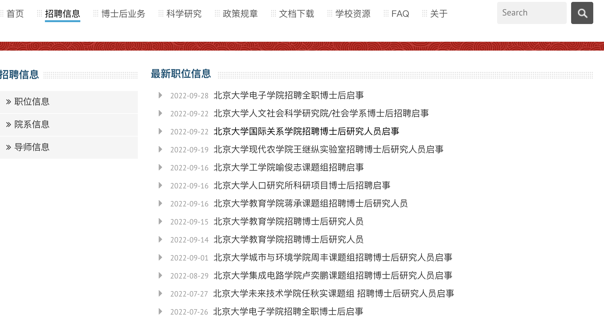

### 1. 北京林业大学

http://www.bjfu.edu.cn/xxgk/index.html
需要vpn或者校园网登录查看招聘信息

###  2. 北京大学

博士后招聘: https://postdocs.pku.edu.cn/zpxx/zwxx/index.htm

### 3. 北京工商大学

博士后：https://hr.btbu.edu.cn/tzgg/tzgg1/60805a5e9ccc4014811c7444b923cc8a.htm

### 4. 清华大学未来实验室

博士后: http://thfl.tsinghua.edu.cn/jrwm/bsh/index.htm

### 5. 造纸研究院

http://www.cnppri.com.cn/1716.html

招聘信息未更新，只有2020年的招聘信息

中建中环生态环保科技有限公司

https://cwepc.cscec.com/zyfz63/rczp63/202209/3576348.html

### 6. 中国科学院化学研究所

http://www.ic.cas.cn/qt/tzgg/

### 7. 中国核工业集团

招聘: https://cnnc.zhiye.com/xylist?k=%E6%9D%90%E6%96%99&d=&c=1100,1102,1103,1105,1107,1109,&p=3^-1,

### 8. 中科院高能物理研究所

http://www.ihep.cas.cn/zszp/zpxx/

### 9. 中建三局一公司

https://hr.zj31.net/recruit#/company_recruit?id=8659

### 10. 北京怀柔实验室

招聘:https://wecruit.hotjob.cn/SU6286556c2f9d246627874843/pb/school.html?workPlaceCode=0%2F4%2F7%2F9&currentPage=1

### 11. 北京七星飞行电子有限公司

http://www.yingjiesheng.com/job-005-936-951.html

### 12. 国家电投

https://spic2023.iguopin.com/job

### 13. 国联汽车动力电池研究院有限责任公司

https://job.iguopin.com/job/detail?id=157639&source=campus

https://job.iguopin.com/job/detail?id=157640&source=campus

### 14.中能建氢能源有限公司

https://job.iguopin.com/job/detail?id=152255&source=campus

### 15. 化学工业出版社有限公司

https://job.iguopin.com/company?id=59bc694eb3ec4e6c9ce85d26163e7cdf

### 16. 中国核电工程有限公司-北京核化工研究设计院

https://job.iguopin.com/job/detail?id=122143&source=campus

### 官网无法进入

中国林业科学研究院林产化学工业研究所
中国林业科学研究院木材工业研究所