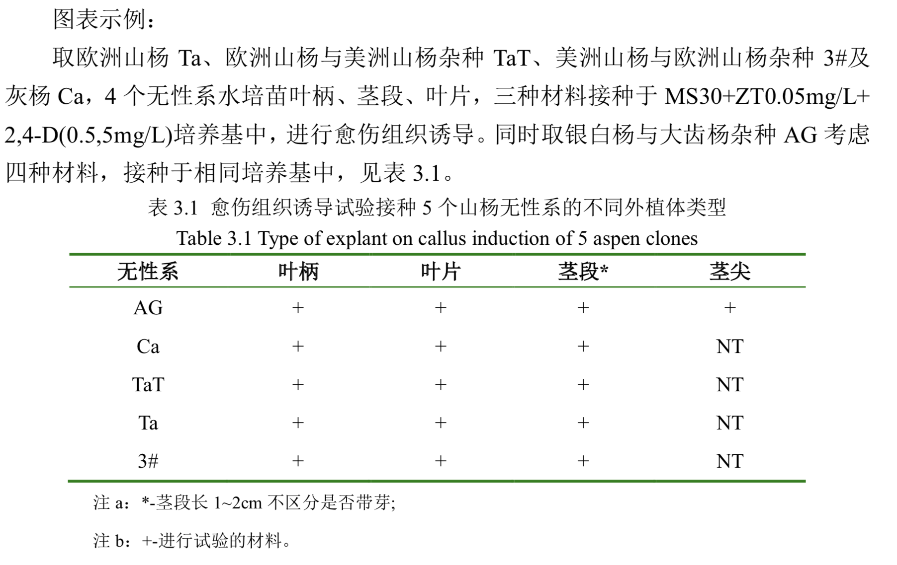
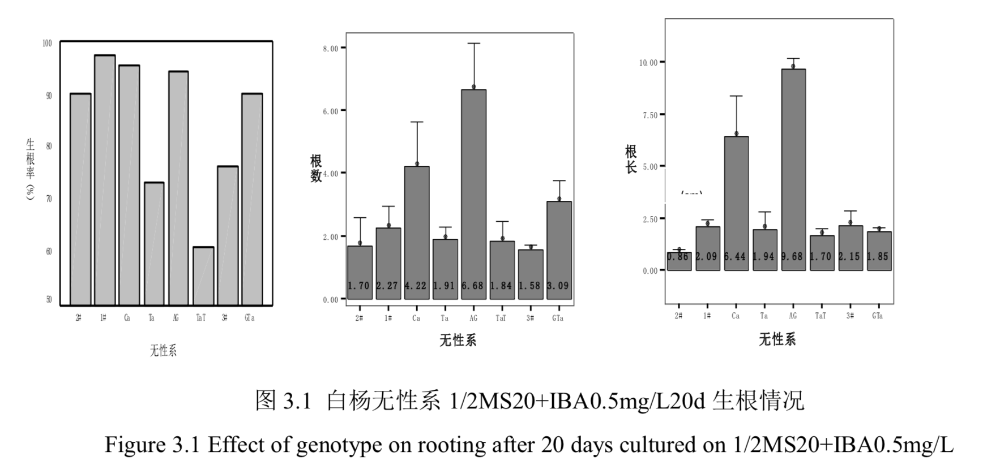
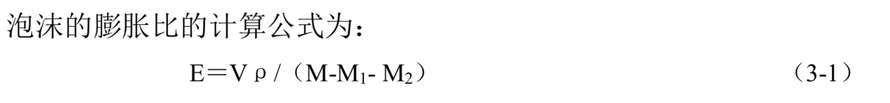
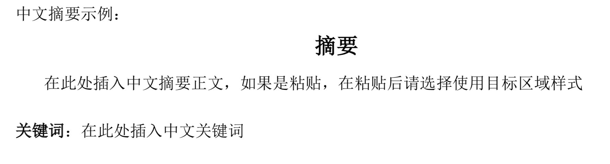
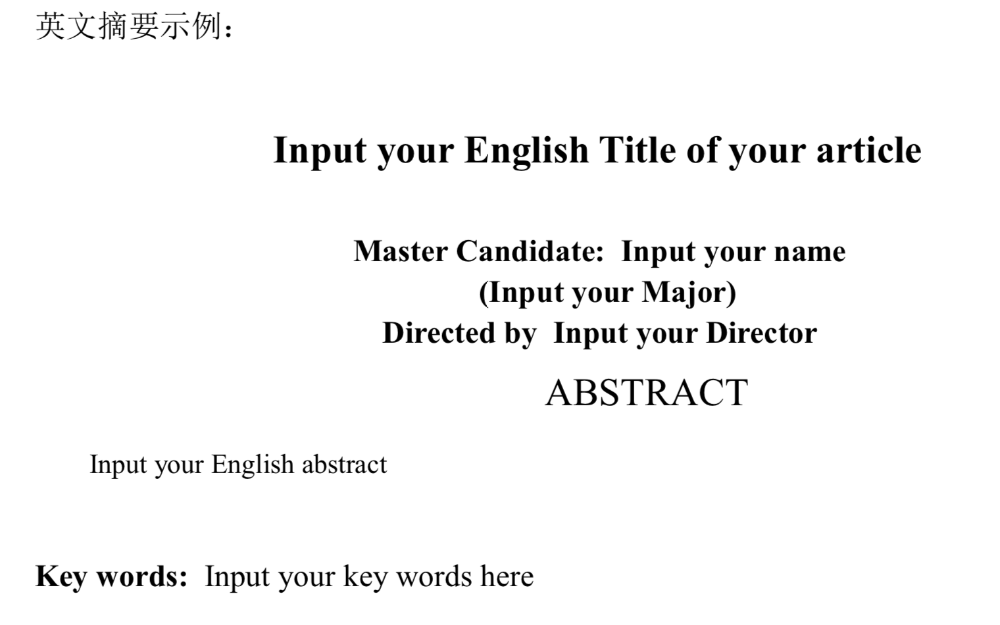
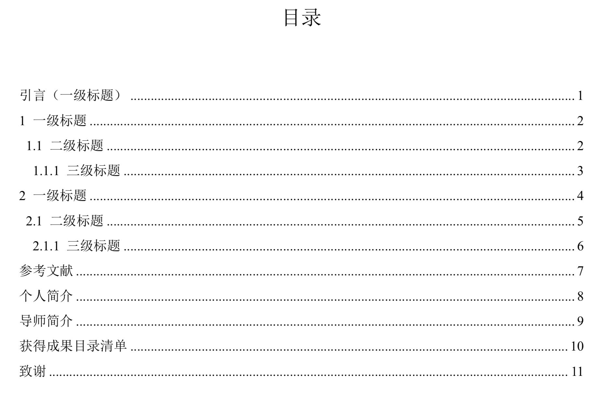
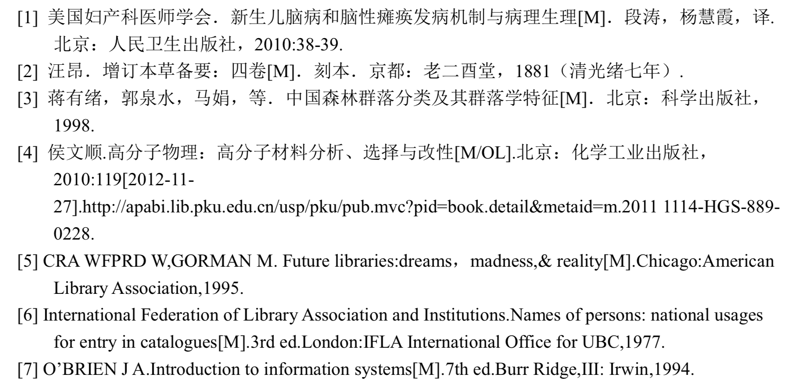

# 论文格式

# 1. 全局

## 1.1标点符号和特殊符号

| 英文符号 | 中文符号                           |
| -------- | ---------------------------------- |
| ,        | ，                                 |
| .        | 。                                 |
| " "      | ” “                                |
|          |                                    |
| []       | 【】      暂不修改，不确定何种方式 |
| ()       | （）                               |
|          |                                    |

## 1.2文字颜色和背景色

删除文字颜色和背景色

```
word 批量替换字体颜色
https://jingyan.baidu.com/article/6fb756ecc7cd4c651858fbd5.html

或者ctrl + a,改为黑色

删除背景色
ctrl+a，改为无背景颜色
```


## 1.3字体和段落

字体类型、字体大小、段落间距、段落缩进

```
全部按照正文字体和段落进行全局调整，后续再局部修改。
宋体小四号字，首行缩进，1.25 行距
```

## 1.4上下角标

涉及到化学表达式和文献。

```
化学分子式：下标。
文献：上标。？ 没有找到依据。
```

```
单独的角标替换方案:
	替换功能中，将格式调整为上标或下标
```


## 1.5关键表达式替换

涉及到化学表达式和关键术语

摄氏度

```
思路：采用剪切板中的内容来进行替换
http://g.pconline.com.cn/x/904/9040627.html
查找内容：待查找内容
替换为：	^c

通配符表
https://blog.csdn.net/weixin_39936792/article/details/111142996
```


## 1.6其他

可能添加或删除空格，添加或删除空白段落等。

```
包括：多余空格、空白段落、全角半角切换
http://t.zoukankan.com/Jacklovely-p-5941240.html
```


# 2.局部修改

## 2.1中文摘要

### 2.1.1 字体和段落

```
(1)标题三号黑体，单倍行距，段前 0.5 行，段后 1 行; 
(2)主体部分用小四号宋体，1.5 倍行距; 
(3)关键词:小四号宋体。
```

### 2.1.2 其他

包含全局中的所有格式调整

## 2.2 英文摘要

### 2.2.1 字体和段落

```
(1)题目用小三号 Times New Roman，单倍行距，段前 0.5 行，段后 1 行; 
(2)主体部分用五号 Times New Roman，1.5 倍行距; 
(3)关键词:小四号 Times New Roman。
```

### 2.2.2 其他

包含全局中的所有格式调整

## 2.3目录

```
目录只列出论文的三级结构标 题，次级标题要依次缩进 1 格。
目录格式:
(1)标题用三号宋体，居中，段前段后 0.5 行距; 
(2)主体部分用五号宋体，全部左对齐，段前段后为 0，行距 1.25 行。
```

## 2.4正文

### 2.4.1标题

```
论文主题结构标题的三级序号格式为: 第 1 级:1
第 2 级:1.1
第 3 级:1.1.1
(前 3 级采用半角数字)
一级标题:黑体三号字，段前 0.5 行，段后 0.5 行; 二级标题:黑体小三号字，段前 0.5 行，段后 0 行;
三级标题:宋体四号字;

论文的条目标题是指在三级结构标题以下的具体内容或条目，按需分层，以少为
宜，建议在三级以内。论文讨论的议题、结论总结的要点均为一级条目。 条目标题的序号格式为:
第 1 级:(1)
第 2 级:1
第 3 级:a. b. c. d....... 标题:宋体四号字;
```

### 2.4.2正文

在全局中已经设置过，不需要再单独设置

```
正文格式 宋体小四号字，首行缩进，1.25 行距
```

### 2.4.3参考文献标引

由于学位论文篇幅相对较长，为便于读者获得参考文献的主要信息，要用(人名、 论文发表年分)为引文基本格式。

在正文中直接引用:需要在首尾加引号，并在引用开始部分(一般为作者姓名后) 用文字表明所引用内容来自哪个作者及出版时间。

例:XXX(2019)指出:“引用内容......”。 在正文中间接引用:间接引用是用本人的语言将引用文献的要点转述出来，不需要用引号，但同样要指出作者和时间。 例:XXX(2019)指出，......;或者:阐述与概述内容......(XXX，2019;XXX,2018)。
 文献为一个作者时，用(Adams,2007)标注;两个作者时，用(Tim and Adams，2007)标注;两个以上作者时，用引文第一作者加“等”，示例为:(丁一等，1980; Tim et al., 2007)标注。

```
  注意:标注时中文文献用作者全名，英文文献用作者姓氏。
```

人文社科类偏重文科的论文，采用当页脚注形式;偏重实证的论文，采用尾注形 式，并在引用句后括号内标明该引文的作者及该文发表的年代。

```
  引文需要用第一手资料，而不是转引。
```

### 2.4.4图表部分

```
(1)图、表等与正文之间要有一行的间距;
(2)表序及表名置于表的上方，表题目中的中文文字有英文标注，中文五号宋 体字，英文五号 Times New Roman.，表采用阿拉伯数字分级编写。表格用三线表。表 头文字宋体加粗，表内文字宋体五号。
(3)图序及图名置于图的下方，图题目中的中文文字有英文标注，中文为五号 宋体字，英文五号 Times New Roman.。图采用阿拉伯数字分级编写。
(4)图、表中的附注写在图或表的下方，采用英文小写字母顺序编号。
```





### 2.4.5公式

```
小四号宋体，公式的编号采用阿拉伯数字分级编写，用括号括起写在右边行末;
其间不加虚线。公式示例:
```



## 2.5参考文献

参考文献应体现本研究领域和研究内容的最新研究进展。

```
参考文献标题三号黑体， 段前 0.5 行，段后 0.5 行，正文五号字，段落 1.25 倍行距。只列作者阅读过，在正文 中被引用过，正式发表的文献资料，中外文献分开，中文在前、外文在后，以第一作 者姓氏拼音的首字母或英文姓氏的首字母为据，从 A-Z 排序。参考文献目录中的作者 十人以下时，全写;如果人数多于十人，写前三名和后三名。
参考文献主体部分可按一般学报格式，五号宋体字，包括作者、题目、来源(出 版期刊名称、年份、眷数、期数和页数。书籍须注明出版单位和年份)
```

## 2.6 附录(如有)

附录是与论文内容密切相关、但编入正文又影响整篇论文编排的条理和逻辑性的 一些资料，例如某些重要的数据表格、计算程序、统计表等，是论文主体的补充内容， 可根据需要设置。

```
附录的格式与正文相同，并依顺序用大写字母 A，B，C，......编序 号，只有一个附录时也要编序号，即附录 A。每个附录应有标题，附录序号与附录标 题之间空一个汉字符。
```

## 2.7 个人简介

个人简介包括但不限于:姓名，性别，出生年月，籍贯，本科及研究生所在学校 专业等情况，获奖及发表论文情况，工作情况或者工作去向等。

```
格式要求:标题三号 黑体，段前 0.5 行，段后 0.5 行，正文宋体小四号字，首行缩进，1.25 行距。
```

## 2.8 导师简介

导师简介包括但不限于:姓名，性别，出生年月，籍贯，职称，社会职务，学术 研究情况，获奖及发表论文情况，研究生工作情况等。个人简介和导师简介分页单列。 

```
格式要求:标题三号黑体，段前 0.5 行，段后 0.5 行，正文宋体小四号字，首行缩进， 1.25 行距。
```

## 2.9 获得成果目录清单

```
将在读期间发表的论文、论著、所获得的成果、奖项等列于论文致谢前。
格式要 求同参考文献，标题三号黑体，段前 0.5 行，段后 0.5 行，正文宋体小四号字，首行 缩进，1.25 行距。
获得成果目录清单分以下三部分按顺序分别列出:
```

(1)已经刊载。按照参考文献格式书写，并在其后加括号，括号内注明该文检 索类型，检索号，期刊的影响因子等。如果该论文未被检索，在括号内注明期刊级别 或属于何种检索源刊，例如 SCI 源刊、EI 源刊、CSSCI 源刊、CSCD 源刊等。
(2)尚未刊载，但已经接到正式录用函的学术论文。按照参考文献格式书写， 在每一篇文献后加括号注明已被××期刊录用，并注明期刊级别或属于何种检索源刊。
(3)其他研究成果。研究成果可以是在学期间参加的研究项目、获得专利或获 奖情况等。获得专利请注明专利名称、作者、专利号;奖项请注明获奖名称、颁奖部 门、获奖时间及个人在获奖者中的名次。

## 2.10 致谢

致谢是作者对该文章的形成作过贡献的组织或个人予以感谢的文字记载，语言要 诚恳、恰当、简短。致谢应另起页，放置在参考文献、分类/关键词索引和勘误页后。 包括国家科学基金，资助研究工作的奖学金基金、合同单位、资助或支持的企业、组 织或个人;协助完成研究工作和提供便利条件的组织或个人;在研究工作中提出建议 和提供帮助的人;给予转载和引用权的资料、图片、文献、研究和调查的所有者;其 他应感谢的组织和个人。

```
致谢字数以不超过一页纸为宜。格式要求:标题三号黑体，段前 0.5 行，段后 0.5 行，正文宋体小四号字，首行缩进，1.25 行距。
```

# 3. 标准示范

## 3.1 摘要示范





## 3.2 目录示范



## 3.3文献示范

